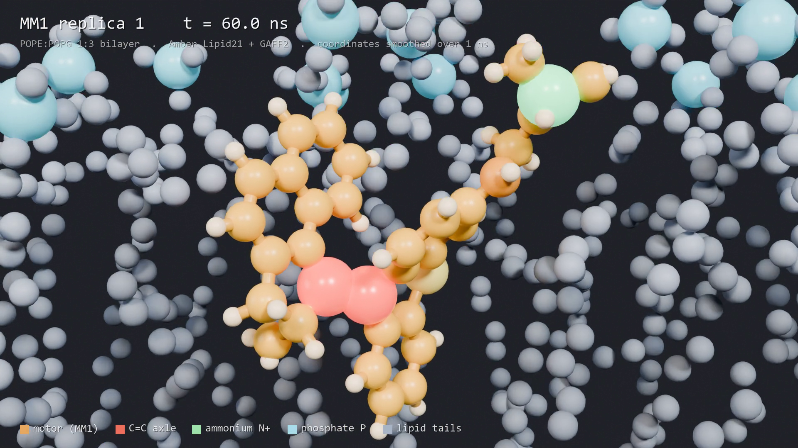
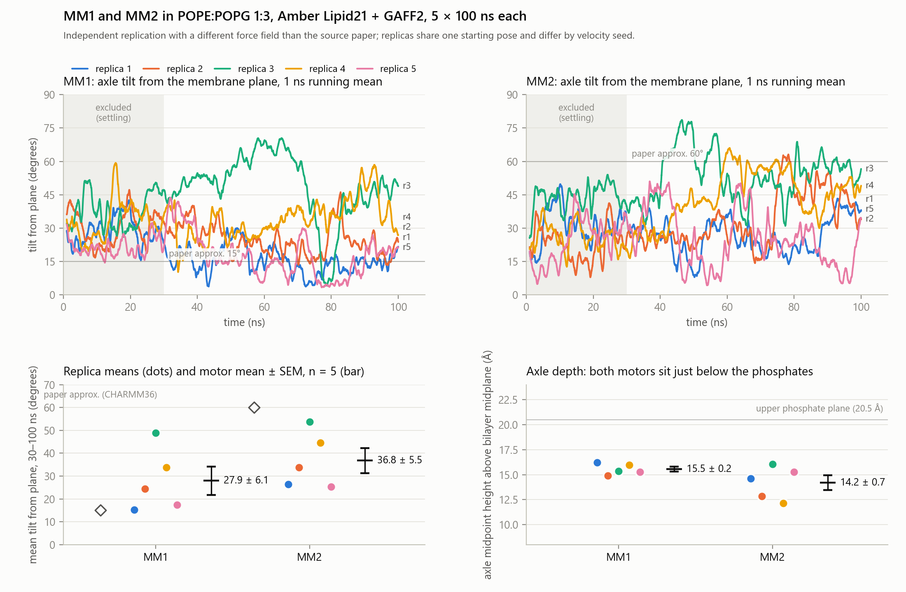
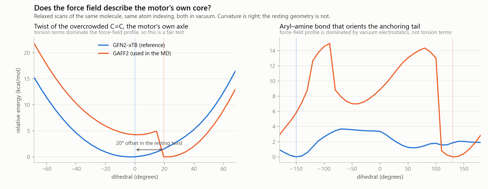

# Where does a light-driven molecular motor actually sit in a bacterial membrane?

A microsecond of all-atom molecular dynamics, run on one consumer graphics card, using a toolchain
with no institutional licences anywhere in it.

Two videos, each the full 100 ns of one simulation, one frame per 200 ps:

- [`media/motor-closeup.mp4`](media/motor-closeup.mp4) — the camera tracks the motor, and the lipids
  between it and the camera are removed each frame so the pocket it sits in stays visible.
- [`media/bilayer-cross-section.mp4`](media/bilayer-cross-section.mp4) — the whole bilayer in
  cross-section, drawn in periodic copies so the membrane runs past both edges of the frame.

Colour is assigned by the job each thing does, not by chemical convention. The membrane is the
setting, so it is held to low-chroma cool slate and lets the lighting carry its shape. The motor is
the subject, so it owns the entire warm half of the colour wheel, which nothing else in the scene
uses. Red marks the two carbons of the C=C axle, the rotor axis whose tilt is the measurement. Green
marks the protonated ammonium, the group that anchors the molecule. Cyan marks lipid phosphorus, so
the two leaflet planes read at a glance.

---

## The manuscript

A preprint-style write-up of everything below is in [`paper/`](paper/), in three forms:

| File | Notes |
| --- | --- |
| [`paper/motors-in-the-membrane.pdf`](paper/motors-in-the-membrane.pdf) | 13 pages, print layout, static figures |
| [`paper/motors-in-the-membrane.epub`](paper/motors-in-the-membrane.epub) | EPUB 3; the two trajectories are embedded as **animated** figures, since readers support GIF far more consistently than video |
| [`paper/motors-in-the-membrane.html`](paper/motors-in-the-membrane.html) | source of both, and the web version |

It carries no DOI. The identifier field is deliberately left unassigned rather than filled with a
plausible-looking string; mint one on deposition. Author names, affiliations, competing interests
and licence are placeholders to be completed before posting. Bibliographic details for the software
references should be checked against the publishers of record.

Both derivatives are rebuilt from the HTML by
[`scripts/paper/build_docs.py`](scripts/paper/build_docs.py).

---

## The question

Zhou and co-workers at Westlake University built modular peptide nanofibres that self-assemble on
bacterial membranes and overcome antimicrobial resistance. Reading around that work leads to a
narrower, mechanical question raised by the Tour group at Rice: their light-driven molecular motors
kill bacteria, and their simulations suggest two variants, MM1 and MM2, sit at very different angles
to the membrane, roughly 15° and 60°.

Orientation and depth are exactly the things classical molecular dynamics measures well. So: rebuild
those systems independently, run them properly, and see whether that contrast survives.

## The constraint that shaped everything

No institutional email address. That rules out CHARMM-GUI, the web service most membrane simulations
are built with, and the CGenFF ligand parameters it depends on, which carry separate terms for
for-profit use.

Every step below therefore uses tools with no institutional gate. This turns out to be the most
transferable thing in the repository, so it is written out in full.

| Step | Tool | What it does |
| --- | --- | --- |
| Ligand parameters | AmberTools 24 (`antechamber`, `parmchk2`) | GAFF2 atom types, AM1-BCC charges for the protonated motor |
| Membrane assembly | `packmol-memgen` | POPE:POPG 1:3 bilayer packed around the motor, Lipid21, TIP3P, Na⁺ + 0.15 M NaCl |
| Overlap removal | OpenMM | L-BFGS minimisation in the Amber representation, before anything touches GROMACS |
| Format conversion | ParmEd | Amber topology to GROMACS, with an explicit energy check |
| Simulation | GROMACS 2026 | equilibration, then 5 × 100 ns per motor on one RTX 4070 |
| Analysis | GROMACS tools only | axle tilt, depth, bilayer thickness, area per lipid |
| Rendering | Blender 5.2, Cycles on the GPU | the videos above, no add-ons required |

Scripts for each stage are in [`scripts/`](scripts/) and the simulation parameters in
[`mdp/`](mdp/).

**One system, in numbers:** 39,542 atoms, 22 POPE and 67 POPG, 9,368 waters, 90 Na⁺ and 24 Cl⁻,
box roughly 6 × 6 × 15 nm. Ten replicas of 100 ns each is 1 µs of sampling, which took 76 hours of
wall time at 296–327 ns/day.

## What we found

Measured over 30–100 ns of each replica, as mean ± standard error across the five replicas. Frames
inside one replica are strongly autocorrelated, so they are not treated as independent samples; the
uncertainty comes from the spread between replicas, which is the only honest denominator here.

| | MM1 | MM2 |
| --- | --- | --- |
| Axle tilt from the membrane plane | 27.9 ± 6.1° | 36.8 ± 5.5° |
| Individual replica means | 15, 25, 49, 34, 17° | 27, 34, 54, 45, 25° |
| Axle height above the bilayer midplane | 15.5 ± 0.2 Å | 14.2 ± 0.7 Å |
| Ammonium height | 19.9 ± 0.8 Å | 21.4 ± 0.6 Å |
| Phosphate-to-phosphate thickness | 4.10 ± 0.03 nm | 4.11 ± 0.02 nm |
| Area per lipid | 57.3 ± 0.5 Ų | 57.2 ± 0.3 Ų |

**Robust.** Both motors anchor the same way in every one of the ten runs: the protonated ammonium
sits at the phosphate plane, about 20.5 Å above the midplane, and the axle 5–6 Å below it in the
glycerol and upper acyl region. No motor left the bilayer in any replica. The depth standard errors
are 0.2–0.8 Å, which is as tight as this kind of measurement gets.

**Directionally consistent, quantitatively unresolved.** MM1 does lie flatter than MM2, the same
ordering as the published 15° versus 60°. But the difference is 8.8 ± 8.2°, and the replica means
overlap heavily. Each motor visits both near-planar and 50–70° orientations on tens-of-nanosecond
timescales, so a single 100 ns trajectory can land almost anywhere in that range.

**Not converged, and the data says so plainly.** MM2's block-averaged tilt climbs monotonically from
28° to 40° across its 100 ns, and MM1's axle drifts outward by about 3 Å. These are trends, not
equilibrium values. The bilayer itself does settle, plateauing after roughly 50 ns.

### How much sampling would this actually take?

[`scripts/analysis/15_sampling_power_jax.py`](scripts/analysis/15_sampling_power_jax.py), run on the
GPU. The tilt signal has an integrated autocorrelation time of about 3.9 ns, so a 70 ns analysis
window holds roughly **8 effectively independent samples**, not the 7,000 frames that were written.

The more useful number is the mismatch. From the within-replica statistics, the mean of a single
replica should scatter by about 3.7°. The observed scatter between replica means is 13°, **3.5 times
larger**. Frames inside one trajectory are therefore not the limiting resource: there is a slow
coordinate that a single 100 ns run does not sample at all. Running each replica longer buys far
less than running more independent replicas.

That also sharpens the negative result. With the observed scatter and five replicas per motor, the
standard error on the difference between the two motors is 8.2°. A genuine 45° contrast would sit
**5.5 standard errors** away and could not have been missed. So this is not merely "we could not
resolve it":

> These simulations are **inconsistent with a 45° orientation difference** between MM1 and MM2, and
> consistent with anything from zero to roughly 25°, under this force field.

To pin the measured 8.8° difference down to two standard errors would need about **17 independent
replicas per motor**, each with a genuinely different starting configuration. That is a concrete,
affordable target: roughly a week on the same single GPU, and far cheaper than the microseconds a
naive reading of the autocorrelation time would suggest.

### Does the force field describe the motor's own core?

The obvious objection to everything above is that the ligand parameters were filled in by analogy,
with penalty scores up to 541 on exactly the torsions that define the motor. So we tested them:
relaxed torsion scans with GFN2-xTB against the GAFF2 parameters actually used, same molecule, same
atom indexing, in [`scripts/qm/`](scripts/qm/). Minutes of compute, not hours.

**The alkene twist is a fair test and it half passes.** Torsion terms dominate the force-field
profile there (a 23.5 kcal/mol span against 4.9 from nonbonded), so the comparison is really about
the parameters. The *curvature* is good: GAFF2 implies a root-mean-square thermal twist of 9.4° at
300 K against 9.8° from xTB, so the core's stiffness, and hence how much it wobbles during MD, is
about right. The *resting geometry* is not. xTB puts the minimum at 0°, essentially planar; GAFF2
puts it at +20°. Since the measured observable is the orientation of that very C=C, a systematic 20°
twist of the core is a real concern, and a specific, fixable one: refit those torsions to this scan.

**The aryl–amine scan turned out not to test what it looked like it tested.** GAFF2 gives it a 15
kcal/mol span against 3.7 from xTB, which looks damning until the energy is decomposed: 11.6 kcal/mol
of that is nonbonded and only 6.5 is torsion terms. In vacuum a +1 tail folding back toward the ring
produces electrostatics that would be screened in a solvated membrane. It is not evidence against the
torsion parameters, and it is not used as such. Checking this took one extra script and changed the
conclusion, which is the argument for doing the decomposition rather than reporting the first number.

Caveats: GFN2-xTB is semi-empirical tight binding, so the region near the minimum is trustworthy and
strongly twisted geometries, where an overcrowded alkene acquires diradical character, are not. Both
scans are in vacuum. The force-field curve has a small discontinuity where the restrained minimisation
jumps branch.

## What we infer is useful here

**A licence-free membrane MD pipeline is a real capability, not a compromise.** The whole thing
runs on a desktop with one gaming GPU and no institutional affiliation. For a small company, an
independent researcher, or anyone locked out of academic web services, that removes what looks like
a hard barrier. The bottleneck turned out to be knowledge, not access.

**Consumer hardware is sufficient for this class of question.** 1 µs of a 40k-atom membrane system
in three days on one card. Orientation, depth, insertion stability and bilayer response are all
within reach. What is not within reach is anything needing microsecond-per-replica convergence.

**Replica spread is the finding, not noise to average away.** Five runs of the identical system gave
tilt means from 15° to 54°. A single trajectory would have produced a confident, publishable-looking
number anywhere in that range. Quantifying that spread is what turns "we could not reproduce it"
into the much stronger "a 45° contrast is excluded at 5.5 standard errors, and 17 independent
replicas would settle the rest" — and it costs an afternoon of analysis on data you already have.

**Spend an hour checking the parameters you inherited.** A semi-empirical torsion scan of the ligand
took minutes and found a 20° error in the resting geometry of the exact bond being measured. Any
paper reporting this observable should show that scan; almost none do.

**Where a force field is weakest is exactly where the interesting science is.** Automated
parameter assignment filled the torsions across the motor's overcrowded C=C axle by analogy, with
penalty scores up to 541. So this setup is trustworthy for *where the molecule sits* and much less
trustworthy for *how its core prefers to twist*. That split should be stated before any mechanism
claim, and it would apply equally to the CGenFF route.

**Negative and null results are cheap here and worth publishing.** Establishing that a reported
contrast is not resolved at this sampling, under a different force field, costs three days of
desktop time. That is a reasonable price for knowing how much a result depends on its methods.

## Pitfalls worth stealing

Each of these cost real time and none of them announced themselves.

**Benchmark before committing to an engine.** LAMMPS with KOKKOS ran a 32,000-atom membrane
benchmark at about 10 ns/day on the GPU, which is the same speed as 16 CPU threads. KOKKOS is double
precision only, and a consumer GeForce card runs double precision at 1/64 of its single-precision
rate. GROMACS in mixed precision managed 409 ns/day on a matched system. The "faster" tool was 40×
slower for this hardware.

**Validate every topology conversion numerically.** The first Amber-to-GROMACS conversion silently
doubled the 1-4 Lennard-Jones energy, +4.9 MJ/mol per system, because Lipid21 uses a non-uniform
1-4 scaling that the direct writer did not carry across. A single-point energy comparison caught it
before a nanosecond was wasted. See [`scripts/build/05_validate_energy.py`](scripts/build/05_validate_energy.py).

**Read the tool's units, not the ones you assume.** `packmol-memgen`'s salt concentration flag means
*total cation* concentration. Neutralising a PG-rich bilayer alone needs about 0.39 M, so asking for
0.15 M simply aborts.

**Equilibrate a small ligand under restraints.** In an unrestrained warm-up at the packed box size,
the motor escaped the under-packed leaflet within 20 ps and re-inserted only once the box contracted.
The production runs therefore sample a re-inserted pose rather than the intended one.

**An orthographic camera looks through the whole box.** The first cross-section render hid 98% of
the motor's atoms behind 32 Å of lipid; what survived were a few specks showing through gaps. Both
views now cut away whatever stands between the camera and the subject, which brings that to 12%
while keeping 55% of the lipids. Clipping with the camera's near plane was tried first and rejected,
because it slices spheres open and shows their black interiors.

**Wrapped trajectories teleport.** `trjconv -pbc mol -center` re-wraps whole molecules as the
centring target moves, so 4.3% of atoms jumped more than 10 Å between neighbouring frames, some by a
full box length. On screen that is flickering static. Unwrapping each residue in time against the
previous frame brings it to 0.07%. See [`scripts/render/export_traj.py`](scripts/render/export_traj.py).

**Most of what you draw is noise.** Lipid hydrogens were 59% of all atoms in the scene and read as
pure speckle, and 90 sodium ions were being drawn as stray grey dots because a selection string had
never excluded them. Dropping both took the scene from 11,414 atoms to 4,560 and made it legible.

## Honest limits

- **Different force field from the study being compared against.** This uses Amber Lipid21 lipids,
  GAFF2/AM1-BCC for the ligand and Amber TIP3P. The original used CHARMM36 with CGenFF. Agreement or
  disagreement reflects force field and sampling as much as molecular behaviour. The torsion scan
  above puts a number on part of that: a 20° offset in the resting twist of the measured bond.
- **One starting pose per motor.** The five replicas differ by velocity seed only, so they sample one
  initial condition five times rather than five independent conditions. The sampling analysis above
  shows this is the binding constraint, not trajectory length.
- **100 ns per replica, with visible drift.** The 30–100 ns analysis window is a compromise, not a
  demonstration of equilibrium.
- **A model membrane, not a bacterial envelope.** 89 lipids of two species. Nothing here speaks to
  antibacterial activity, to the outer membrane, or to what a motor does when driven by light. These
  are ground-state simulations with no photochemistry.
- **Coordinates in the videos are smoothed** over a 1 ns centred running mean, which removes about
  70% of frame-to-frame jitter and is what makes the motion readable. It is stated on every frame and
  is never applied to the analysis.

## What would settle the open question

About 17 independent replicas per motor, built from genuinely different starting poses with
restrained equilibration, which the sampling analysis says is worth far more than longer runs. Then
refit the axle torsions against the scan in `data/torsion-validation.json` and repeat, to separate
the force-field offset from the physics. If a direct comparison to the original is required, the same
protocol under CHARMM36 with a CGenFF licence.

## Reproducing

Run the stages in order. `scripts/build` needs AmberTools, OpenMM, ParmEd and RDKit;
`scripts/analysis` needs only GROMACS; `scripts/render` needs Blender 5.2 and, for the export step,
MDAnalysis. Paths inside the scripts point at the machine they ran on and need editing.

The raw trajectories are about 15 GB and are not in this repository. `data/summary.json` holds every
per-replica number behind the table and the figure.

## Credits

- Zhou et al., *Modular peptide nanofibres that self-assemble on bacterial membranes overcome
  antimicrobial resistance*, Nature Biomedical Engineering (2026), Wang lab, Westlake University.
  [doi:10.1038/s41551-026-01680-0](https://doi.org/10.1038/s41551-026-01680-0) — the starting
  inspiration.
- Santos et al., *Light-activated molecular machines are fast-acting broad-spectrum antibacterials
  that target the membrane*, Science Advances (2022), Tour lab, Rice University.
  [doi:10.1126/sciadv.abm2055](https://doi.org/10.1126/sciadv.abm2055) — the motors MM1 and MM2 and
  the system specification reproduced here.
- Lipid21: Dickson et al., J. Chem. Theory Comput. (2022). packmol-memgen: Schott-Verdugo and Gohlke,
  J. Chem. Inf. Model. (2019). GROMACS, AmberTools, OpenMM, ParmEd, MDAnalysis, Blender.
